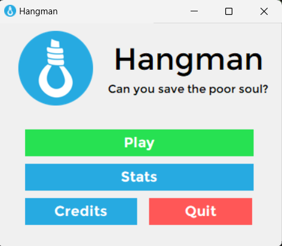
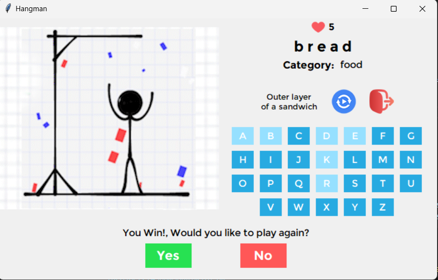
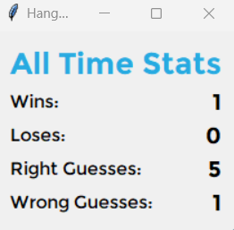
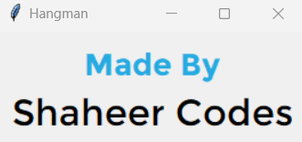

# HangmanPy
A Very Unoptimized Hangman Game made using Python and TKinter.

## Installation For Source Code
1. Clone This Repository to your machine
2. Create a Python virtual environment (optional but recommended) using Command Prompt in the Repository Folder:
```python -m venv venv```
3. Install the required Python packages using Command Prompt:
```pip install -r requirements.txt```
4. Done!

## Just Want to Play The game?
Download hangmanpy.rar in the build folder, extract it and launch hangmanpy.exe!

## Screenshot of the Software:-



